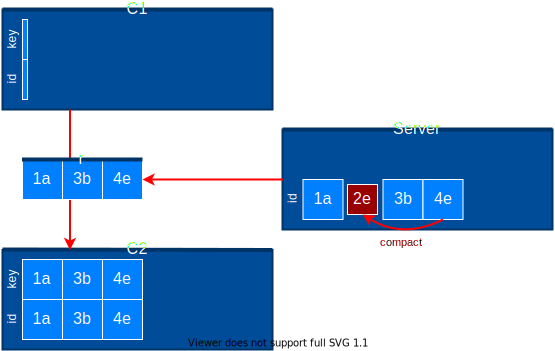
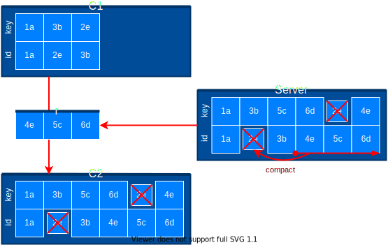
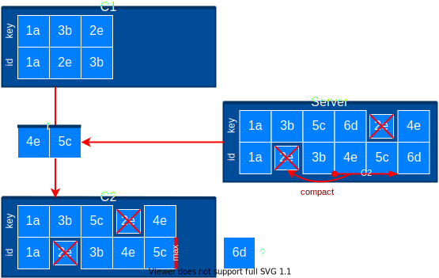
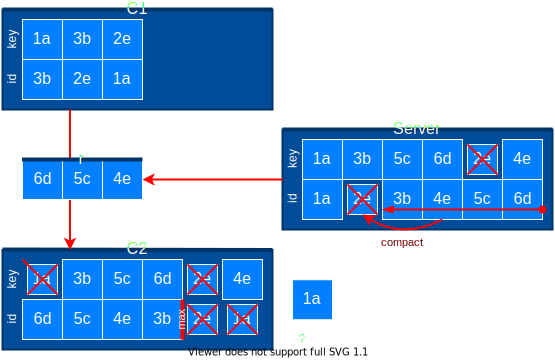
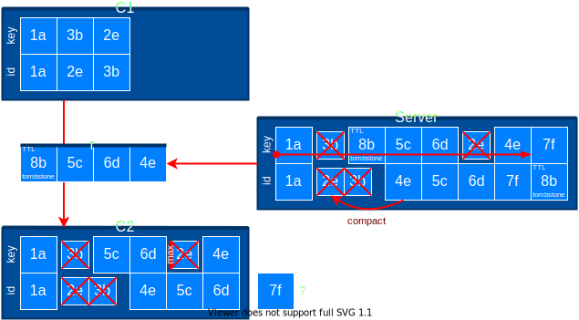
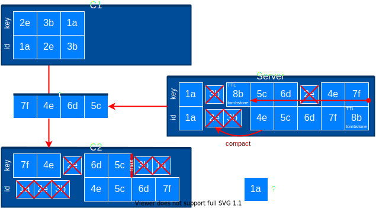

# List

messages are compacted based on their key

- ```javascript
  after: number;
  ```

- ```javascript
  sortBy: 'id' | 'key';
  ```

- ```javascript
  sort: 'asc' | 'desc';
  ```

  A pipe can restrict the number of values stored. A message can have a maximum number of values set. Note, it probably
  doesn't make sense to use compact

# `compact:true, sortBy:'id'`

- `after:0`

  ```javascript
  // c1 = []
  const p = pipe({ compact: true, path: '/examples' });
  const r = p.sync({ sortBy: 'id', after: 0 });
  // r = [1a, 3b, 4e]
  // c2 = [1a, 3b, 4e]
  ```

  <u>list-compact-id-after0.drawio.svg</u>

  

- `after:3`

  ```javascript
  // c1 = [1a, 2e, 3b]
  const p = pipe({ compact: true, path: '/examples' });
  const r = p.sync({ sortBy: 'id', after: 3 });
  // r = [4e, 5c, 6d]
  // c2 = [1a, 3b, 4e, 5c, 6d]
  ```

  <u>list-compact-id-after3.drawio.svg</u>

  

# `compacted:true, sortBy:'id', max:4`

- `after:3, sort:'asc'`

  I don't understand this use case. Only give me the 4 oldest rows?

  ```javascript
  // c1 = [1a, 2e, 3b]
  const p = pipe({ compact: true, path: '/examples' });
  const r = p.syncById({ sortBy: 'id', sort: 'asc', after: 3, max: 4 });
  // r = [4e, 5c]
  // c2 = [1a, 3b, 4e, 5c]
  ```

  <u>list-compact-id-max-asc.drawio.svg</u>

  

- `after:3, sort:'desc'`

  I don't understand this use case. Only give me the 4 newest compacted rows...

  ```javascript
  // c1 = [3b, 2e, 1a]
  const p = pipe({ compact: true, path: '/examples' });
  const r = p.syncById({ sortBy: 'id', sort: 'desc', after: 3, max: 4 });
  // r = [6d, 5c, 4e]
  // c2 = [6d, 5c, 4e, 3b]
  ```

  <u>list-compact-id-max-desc.drawio.svg</u>

  

# `compacted:true, sortBy:'key', max:4`

- `sort:'asc'`

  ```javascript
  // c2 = [1, 2, 3]
  const p = pipe({ compact: true, path: '/examples' });
  const r = p.sync({ sortBy: 'id', after: 3, sort: 'asc', max: 4 });
  // r = [4]
  // c3 = [1, 2, 3, 4]
  ```

  <u>list-compact-key-max-asc.drawio.svg</u>

  

- `sort:'desc'`

  ```javascript
  // c2 = [1, 2, 3]
  const p = pipe({ compact: true, path: '/examples' });
  const r = p.sync({ sortBy: 'id', after: 3, sort: 'desc', max: 4 });
  // r = [4]
  // c3 = [1, 2, 3, 4]
  ```

  <u>list-compact-key-max-desc.drawio.svg</u>

  
