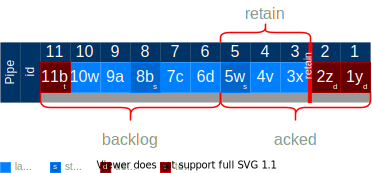

# Pipe


Decisions about default settings mean that it's possible you will get errors when reaching limits, but you have to
intentionally configure the system to have an unbounded cloud storage bill. You should never be surprised by a large
bill when using default configuration values. The defaults then are such that each pipe will only keep 10,000 messages
or rows unless you specifically change this

## Definitions


- backlog - Unacknowledged messages. If a [Consumer](../Consumer/Consumer.md) is attached to a pipe, then the message
  remains in the backlog until all consumers have acknowledged the message.
- acked - A [Consumer](../Consumer/Consumer.md) acknowledges each message. Once all consumers ack a message, it moves
  from backlog to acked. Once all consumer's acknowledge a message, it is deleted unless the pipe has a retain policy.
- retain - By default, messages are deleted once acknowledged. Specifying a retain will determine how long to keep acked
  messages.
- max - The maximum that the backlog can grow.
- ttl - How long messages should remain in the pipe before being removed. Messages can be in either backlog or acked
  state when considering the ttl.

---

## `retain`

---

```typescript
retain?: undefined | boolean | {
  // Retain messages for a duration
  duration?: undefined | string; // ISO-8601 Duration string

  // Retain a maximum of count messages
  count?: undefined | number;

  // size?: undefined | number; Unsupported. Retain a maximum of size KB of messages
};
```

Keep the data for some time after acknowledgement. Default is to delete when all consumers have acknowledged the
message.



retain and ttl solve two different problems. Most applications will want to use at most one of these.

You can persistently store messages that are not within a backlog (because they've been acknowledged by on every
existing subscription, or because there are no subscriptions) by setting retain policy.

- `retain` - If this is `undefined`, messages will not be retained. If true, then all messages are retained forever. If
  false, they are deleted once all consumers have acknowledged
- `retain.duration` - Default is `P0D`. The length of time to retain a message as an
  [`ISO-8601 Duration string`](https://en.wikipedia.org/wiki/ISO_8601) Examples: `'P1Y'`,`'P1M'`, `'P1D'`, `'P0D'`. If
  this is `undefined`, then duration will not be used to determine how long to retain a message.
- `retain.count` - Default is `undefined`. The maximum number of messages to retain. If this is undefined or zero, then
  count will not be used to determine if a message should be retained

### Examples

```javascript
// Default is to not retain any messages
options = { retain: { duration: 'P0D' } };
// Keep at most 100 messages
options = { retain: { count: 100 } };
// Keep at most 100 messages for at most 5 minutes
options = { retain: { count: 100, duration: 'PT5M' } };
// Retain all messages forever...
options = { retain: true }; // Simply retain without any qualificaitons
options = { retain: {} }; // We retain, but we don't restrict by either duration or count
options = { retain: { duration: 'P1000Y' } }; // 1,000 years is probably good enough. If not, make it as big as you like...
```

---

## `ttl`

---

```javascript
// Delete backlog messages if they are older than a ttl
ttl?: undefined | string; // ISO-8601 Duration string
```

Discard message after some time regardless of acknowledgement. Default is undefined which is do not discard.


retain and ttl solve two different problems. Most applications will want to use at most one of these.

Discard data after some time (by automatically acknowledging). Messages that are not acknowledged within a specified
timeframe can be automatically acknowledged, by specifying the time to live (ttl).

- `ttl` - Default is `undefined`. The length of time to retain a message as an
  [`ISO-8601 Duration string`](https://en.wikipedia.org/wiki/ISO_8601) Examples: `'P1Y'`,`'P1M'`, `'P1D'`, `'P0D'`. If
  this is `undefined`, then time will not be used to determine when to delete a message.

---

## `max`

---

```javascript
max: {
  // Maximum number of messages in backlog
  count?: undefined | number;
  // Maximum duration a message can be in the backlog
  duration?: undefined | string;
  // What to do when we try to post a message when it's at the max
  policy?: 'error' | 'delete';
}
```

Prevent the backlog from growing out of control.


- `max.count` - Default is `10000`. This is the maximum size of records that can be in the backlog.
- `max.duration` - Default is `undefined`. The length of time to a message should stay in the backlog. Defined as an
  [`ISO-8601 Duration string`](https://en.wikipedia.org/wiki/ISO_8601) Examples: `'P1Y'`,`'P1M'`, `'P1D'`, `'P0D'`. If
  this is undefined, then duration will not be used to determine how long to keep a message in the backlog.
- `max.policy` - What happens when we reach the maximum backlog size? Default is `error`.
  - `error` - DEFAULT. An error is returned to the producer when they try and post a new message.
  - `delete` - Oldest messages will be deleted and then the newest message will be allowed

### Examples

```typescript
// Keep the latest 100 records
options = { max: { count: 100, policy: 'delete' } };
// Make sure the Consumers are not more than 100 records behind
options = { max: { count: 100 } };
// Make sure Consumers are never more than 1 day behind
options = { max: { duration: 'P1D' } };
```

---

## `compact`

---

```javascript
// Older messages will be compacted based on their key
compact: boolean;
```


Compaction only works on messages that have keys.

When object e is updated `{key:'e', id: 4}`, it marks older messages with the same key as compacted. When a consumer
reads from this topic, it will skip over all compacted messages.

### Examples

```typescript
// What's the use case for compacting without retaining?
options = {
  compact: true, // only one object per key
};
// Materialized table...
options = {
  compact: true, // only one object per key
  retain: true, // Retain forever
  // max..., since we will have zero consumers, messages are always acknowledged so no need to specify
};

// Top five rows of some list...
options = {
  compact: true, // only one object per key
  retain: true, // Retain forever
  max: { count: 5, policy: 'delete' },
};
```

---

# Not implemented...

## `access`

- `shared` - default. Multiple producers can publish on a topic.
- `exclusive` - Only one producer can publish on a topic.

  If there is already a producer connected, other producers trying to publish on this topic get errors immediately.

## `schema`

A schema can be attached to a pipe. All messages sent to this pipe must conform to this schema.

- avro? reduced bandwidth consumption
- json-schema?
- [JTD (jsontypedef)](https://jsontypedef.com/)?
- [official protobuf (broken state)](https://github.com/protocolbuffers/protobuf-javascript)
- [protobuf (not bloated)](https://buf.build/blog/protobuf-es-the-protocol-buffers-typescript-javascript-runtime-we-all-deserve)

## `migrations`

supported via functions. Functions can run before the server acknowledges receipt. This is useful if you want to
maintain backwards compatibility of messages with schemas. A v1 app can publish a v1 message to this pipe even though
the pipe is v2. It would run a pre-publish function to transform the v1 message to a v2 message (or v3,v4, etc).

## `functions`

A function can be attached to a pipe to execute before input, or after output.

## `tenant`

The tenant for a pipe. Used for segregating data. This tenant
