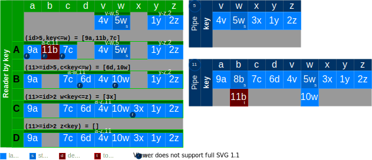
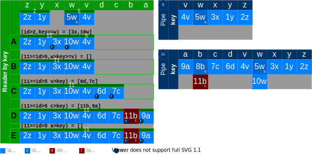

# Reader

Reader can read from any point in the pipe. It can read sorted by id, or it can read sorted by key.

# `next()`

Calling next on a reader retrieves the next set of records from the server. This should implement the iterator
interface.

```typescript
const reader: Reader = pipes.reader('/examples');
let diff;
do {
  diff = await reader.next();
} while (diff);
```

# `sortBy:'id'`


```javascript
const r1 = reader('/examples', { sortBy: 'id', sort: 'desc', id: [5, undefined], key: [undefined, 'w'], limit: 2 });
const A = await reader.next();
const B = await reader.next();
const C = await reader.next();

const r2: Reader = reader('/examples', { sort: 'desc', id: [5, undefined], key: [undefined, v] });
const r3: Reader = reader('/examples', { sort: 'asc', id: [5, undefined], key: [undefined, v] });
```

# `sortBy:'key', sort: 'asc'`

**IMPORTANT:** Your results can be out of date immediately following this call unless subscribed.



If at state 10 the user starats reading at `key a`, and then immediately `state 11` deletes element `key=b`, The reader
will still deliver element `b`.

A pipe with millions of rows...

```typescript
//
const p = reader('/examples', { limit: 2, sortBy: 'key' });
// a: id>5, key<=w
// a: id: [5,undefined], key: [undefined, 'w']
const results = {
  idRange: [],
  keyRange: [],
  state: 11,
  values: ['9a', '7c'],
};

// b: id:[5,11], key: [undefined, 'w]
```

# `sortBy:'key', sort: 'desc'`


