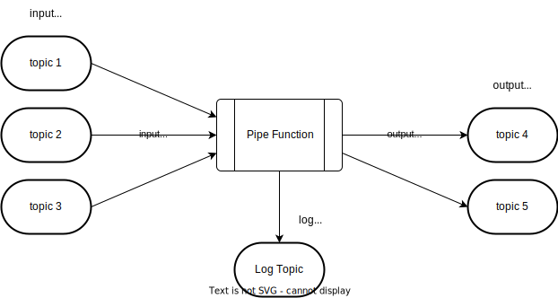

# Pipe functions

Functions can be attached directly to a stream to directly process messages and publish to other pipes. These can be
written in javascript or any language that can export to webassembly.

## References:

- Stream processing engines such as Apache Storm, Apache Heron, and Apache Flink
- Serverless cloud platforms like like Amazon Web Services Lambda, Google Cloud Functions, and Azure Cloud Functions
- [Secure js sandbox](https://github.com/patriksimek/vm2)
- [webassembly](https://webassembly.org/)

## Processing guarantees

I don't yet know enough about this to figure out what we can or should support...

| Delivery Semantics | Description                                                          |
| ------------------ | -------------------------------------------------------------------- |
| at-most-once       | is likely to be processed, or not to be processed (hence "at most"). |
| at-least-once      | can be processed more than once (hence the "at least").              |
| effectively-once   | will have one output associated with it.                             |
