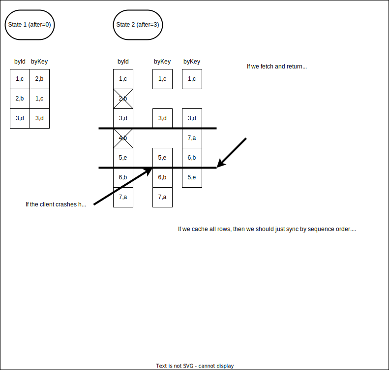

# PipesDB Messages

ZeroOps messaging, database, api platform that doesn't lock you into any vendor. Focus on your data, not data
management.

Features:

- Visual diagram about how messages flow through the system
- Tracks dependencies between message queues so you know how data transforms through your system

Inspired by:

- [Apache Pulsar](https://pulsar.apache.org/docs/concepts-overview): Scalable, persistent messages.
- [Microsoft's Orleans](https://dotnet.github.io/orleans/): This builds on the idea of a remote actor system where there
  is a distributed actor that processes messages. To scale, it is important to understand how to partition messages.
- [akka](https://akka.io/)

# Messages

Messages can be retrieved starting at the beginning, or the end. You can also specify the size of the window of messages
you wish to receive. You may wish to retrieve messages by the latest if you want to see the last log messages of a
topic. When you fetch the next batch of rows, what is returned is based on your current window.

- This is affected by topic compaction. Older messages with same key are deleted.
- This is also affected by the window of messages the client tells the server it has.
- It is possible for there to be rows both before, after, and in between the window of data the client has. this usually
  happens when the key is used to maintain a sorted list of data.

| field | type    | description                                               |
| ----- | ------- | --------------------------------------------------------- |
| id    | ulid    | ordered string id. Supplied by server. Timestamp embedded |
| key   | string? | Optional key supplied by client. Required for compacting. |
| seq   | number  | increasing integer of the pipe starting with 1            |
| time  | number  | UTC of when the message was accepted                      |

### Use Case for compacted topics

1. The "current" state of an object. Think of a table in a database.
2. A sorted list of these objects. Think of an index in a database. The key is an alphanumerically sortable key.



## Order by id (order = 'asc', by = 'id')

This is the simplest messaging to understand. When the client asks for messages, the server sends back messages starting
at the first message. It sends the messages in order.

```javascript
const pipe = new Pipe('/messages');
```

window=`3`, tail=`3`

| id  | key | seq |             |
| --- | --- | --- | ----------- |
| 1   | c   | 1   | send 1st    |
| 2   | b   | 2   | send 2nd    |
| 3   | d   | 3   | send 3rd    |
|     |     |     | `reconnect` |
| 4   | b   | 4   | sent 4th    |
| 5   | e   | 5   | sent 5th    |
| 6   | b   | 6   | sent 6th    |
|     |     |     | `more`      |
| 7   | a   | 7   | sent 7th    |

## Order by id desc (order: 'desc', by: 'id')

The client first subscribes to all messages going forward. Then it backfills by a specfied amount of records until it
reaches its cache limit. If there is no limit, then it will cache all messages since the beginning of time.

```javascript
const pipe = new Pipe('/messages', { cache: true, limit: 1000, order: 'desc', by: 'id' });
```

window=`3`, tail=`3`

| id  | key | seq |             |
| --- | --- | --- | ----------- |
| 1   | c   | 1   | send 3rd    |
| 2   | b   | 2   | send 2nd    |
| 3   | d   | 3   | send 1st    |
|     |     |     | `reconnect` |
| 4   | b   | 4   | !!! GAP !!! |
| 5   | e   | 5   | sent 6th    |
| 6   | b   | 6   | sent 5th    |
| 7   | a   | 7   | sent 4th    |

## by id (compacted by key)

window=`3`, tail=`3`

| id  | key | seq |                       |
| --- | --- | --- | --------------------- |
| 1   | c   | 1   |                       |
| 2   | b   | 2   |                       |
| 3   | d   | 3   |                       |
|     |     |     | `reconnect` or `live` |
| 4   | b   | 4   | removed (compacted)   |
| 5   | e   | 5   | sent                  |
| 6   | b   | 6   | sent                  |
| 7   | a   | 7   | sent                  |

## order by key (compacted by key)

There will be potential gaps when retrieving messages by key. Since these can be sort keys, it's possible that there are
many rows interleved in the data window that we last fetched.

So, when we request more, we must always include the tail and the server will send ALL records after that tail in
ascending order of the key. If record "a" keeps changing, it's possible that we keep getting record "a" when we request
"next". The server gets all rows greater than the last message it knows the client has ordered by key.

How does the client know it is up to date with the server

The client knows it's not yet up to date because the server will respond with the records requested and (?a "more" id?)

#### Invalidating local data

- If offline for too long... We tombstone deleted keys with a TTL so if the client's last update time is greater than
  the TTL gap, then it doesn't know if it missed data so invalidates the local copy of data. This will cause the local
  data to be deleted.
- If this is an offline cache of messages, then no matter the situation, if we are syncing all the rows, it's better to
  NOT dump the data. If it's not an offline cache, then we should start from the beginning. In fact, it doesn't make
  sense to read by compacted key if it's an offline copy does it? Sure it does. we just start from the beginning and
  always send to the client, then we send any records that have come in since the beggining of the operation...

  What about gaps? They will get filled in as long as we don't update our last updated id. Now, we can choose to spin
  for the client until we are completely updated or we can update the rows as we get them in.

window=`3`, tail=`4`, keyHead=`b`, keyTail=`d`

| id  | key | seq |                        |
| --- | --- | --- | ---------------------- |
| 2   | b   | 2   |                        |
| 1   | c   | 1   |                        |
| 3   | d   | 3   |                        |
|     |     |     | `reconnect` or `live`  |
| 7   | a   | 7   | sent: key < b          |
| 4   | b   | 4   | removed (compacted)    |
| 2   | b   | 2   | removed (compacted)    |
| 6   | b   | 6   | sent: key <= b, id > 4 |
| 1   | c   | 1   | not sent: id < 4       |
| 3   | d   | 3   | not sent: id < 4       |
| 5   | e   | 5   | not sent, key > d      |

## by

# Message Retention

Inspired by ideas in [Pulsar](https://pulsar.apache.org/docs/concepts-messaging/#message-retention-and-expiry)

- Effectively-Once
- nack: Consumer can negatively acknowledge a message forcing a re-delivery
- retention: All messages by default are deleted once they have been acknowledged by consumers.
- expiry: By default, unacknowledged messages stay in the queue forever. If a message has a TTL, then the message will
  be deleted after the TTL has expired.

- No: Delayed message delivery
