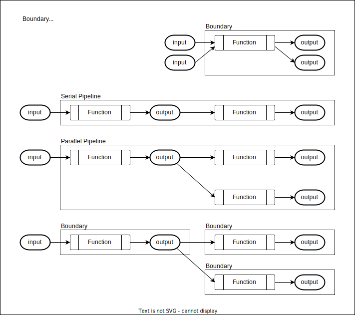
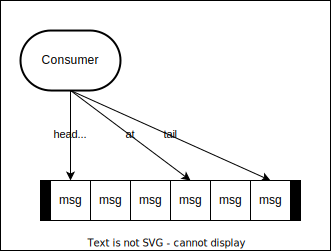

# Pipe

A Pipe is a message topic. A pipe has an optional schema. A pipe has ordered messages.

# NOT IMPLEMENTED

## **compacted**

A pipe can be compacted by it's key. This is useful for example when representing the current state of an object.

## **schema**

[JTD (jsontypedef)](https://jsontypedef.com/)

A schema can be attached to a pipe. All messages sent to this pipe must conform to this schema.

## **TTL**

If the server has set a TTL for delete records, then if the client connects to the pipe outside the TTL, the server will
need to resend all the records because the deleted tombstone records would not be sent back to the client.

## **limit**

If a limit is set, then the pipe will truncate the local copy to the number specified in limit.

## **tenant**

The tenant for a pipe. Used for segregating data. This tenant

## **functions**

A function can be attached to a pipe to execute before inputs, and after outputs.

## **TTL**

By default, unprocessed messages are saved to disk forever. Pipes can be marked with a TTL so unprocessed messages will
be deleted after a certain time.

## **retention**

By default, messages are deleted after all consumers have acknowledged the message. A retention policy can change this
behavior to store messages for a duration after they have been processed.

OR!!!! By default, messages are saved. A Pipe can be marked as non-persistent so the message never is saved.

## **migrations**

supported via functions. Functions can run before the server acknowledges receipt. This is useful if you want to
maintain backwards compatibility of messages with schemas. A v1 app can publish a v1 message to this pipe even though
the pipe is v2. It would run a pre-publish function to transform the v1 message to a v2 message (or v3,v4, etc).

# Consumer...

- **sync-send** - Producer waits for ack
- **async-send** - Producer does not wait for ack, messages can be lost

- **ack-cummulative** - Consumer can acknowledge receiving all messages upto and including the message being
  acknowledged `ack(msg, true)`
- **ack-one** - Consumer acknowledges individual messages. `ack(msg)`
- **nack** - Consumer can negatively acknowledge a message. Useful in the case of errors. May cause a retry? `nack(msg)`
- **regex** - Subscriptions can be based on a single topic, or a regular expression like `/public/finance-.\*`
