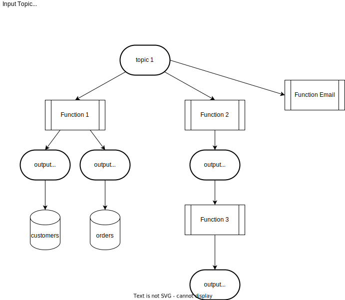
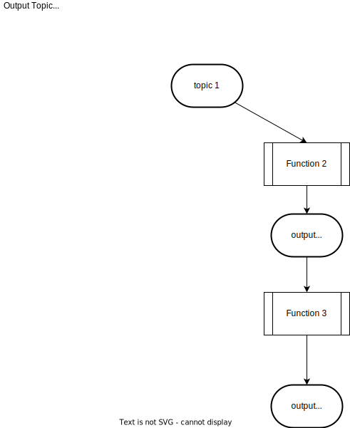

# pipeline

A pipeline is the full picture of a topic. It describes all the inputs, outputs, and functions affected by a topic. The
simplest example of a pipeline is:

`input -> function -> output`

An input can be understood by seeing all the downstream impacts that happen.

An output can be understood by seeing all the functions and inputs that affect it.

